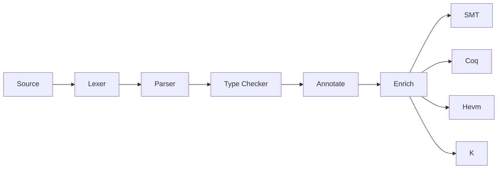

# Internals

## The Act AST Type

All act specs are transformed into typed AST instances. The definition of this AST type can be found
in [Syntax/TimeAgnostic.hs](https://github.com/ethereum/act/blob/master/src/Syntax/TimeAgnostic.hs).

The top level datatype here is a `Claim`, and the output of the frontend states is a list of
(`Timed`) claims. A `Claim` is a sum type (enum) with four potential values:

- `C`: constructor
- `B`: behaviour
- `I`: invariant
- `S`: typing information for storage variables

### Pass and Fail Claims

Act specs are intended to be fully exhaustive, for this reason we generate two claims from each
constructor / behaviour in the spec:

1. `Pass`: The Pass claim states that if all preconditions in the iff block are true, then all executions will succeed, storage will be updated according to the storage block, and the specified return value will, in fact, be returned.
1. `Fail`: The Fail claim states that should any of the preconditions be false, all executions will revert.

Taken together a succesfull proof of these claims ensures that a given bytecode object implements
only the behaviour specified in act *and nothing else*.

### Timed vs Untimed Instances

AST instances can be either `Timed` (explicitly timed storage references) or `Untimed` (implicitly
timed storage references), and this distinction is reflected at the type level (the `t` parameter in
most of the data type definitions).

In some parts of an act spec (`returns` and `ensures` blocks), storage references must be qualified
with either the `pre` or `post` operator to disambiguate references to storage in the pre or post
state. In other blocks storage references are either implicitly refering to both pre and post states
(`invariants`), or to the pre state only (e.g. `storage`). In order to simplify implementation in
the various backends, there is a frontend stage (`annotate`) that makes all implicit timings
explicit. The type parameter allows us to enforce the invariant that all backend stages always
operate on `Timed`  AST instances.

## Compilation Pipeline

The act compilation pipeline is as follows:

### Lexer

Converts the source code into a sequence of tokens that can be consumed by the parser. We use
[alex](https://www.haskell.org/alex/) to generate a lexer from the specification in
[Lex.x](https://github.com/ethereum/act/blob/master/src/Lex.x).

### Parser

Parses a sequence of tokens into an untyped AST. We use [happy](https://www.haskell.org/happy/) to
generate a parser from the specification in
[Parse.y](https://github.com/ethereum/act/blob/master/src/Parse.y). The untyped AST is defined in
[Syntax/Untyped.hs](https://github.com/ethereum/act/blob/master/src/Syntax/Untyped.hs).

### Type Checker

The type checker takes an untyped AST, checks that none of the typing rules are violated, and
produces a typed AST. The typechecker is defined in
[Type.hs](https://github.com/ethereum/act/blob/master/src/Type.hs) and the core typed AST definition
is in
[Syntax/TimeAgnostic.hs](https://github.com/ethereum/act/blob/master/src/Syntax/TimeAgnostic.hs).
The meaning of the timing parameter to the AST is described below in
[Timed vs Untimed AST instances](#timed-vs-untimed-ast-instances).

### Annotation

The annotate stage makes any implicit timings explicit. This stage is implemented in
[Syntax/Annotated.hs](https://github.com/ethereum/act/blob/master/src/Syntax/Annotated.hs).

### Enrichment

The enrich stage adds preconditions to all behaviour / constructor / invariant instances based on
the types of all variable references. This staged is implemented in
[Enrich.hs](https://github.com/ethereum/act/blob/master/src/Enrich.hs).

## Error Handling

Stages that need to present errors to the user should return an instance of the `Error` type defined
in [Error.hs](https://github.com/ethereum/act/blob/master/src/Error.hs). This is a modified instance
of [Data.Validation](https://hackage.haskell.org/package/validation-1.1.2) specialised to the act
context. This type allows us to accumulate multiple error messsages (useful if e.g. multiple syntax
errors are present), and we also have unified routines to pretty print these messages.

